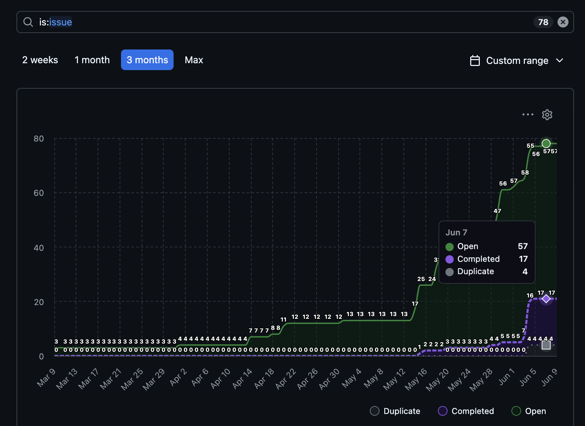
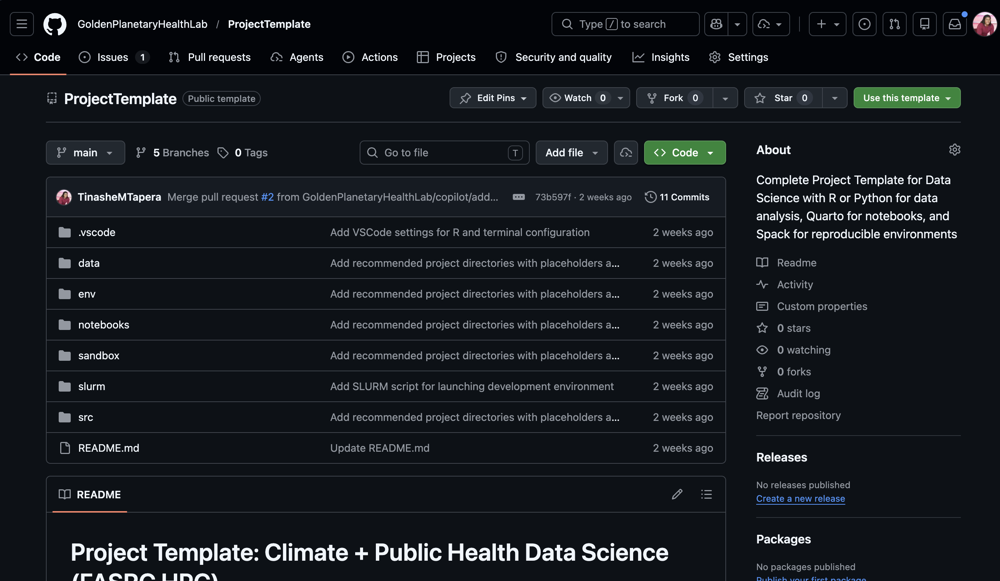
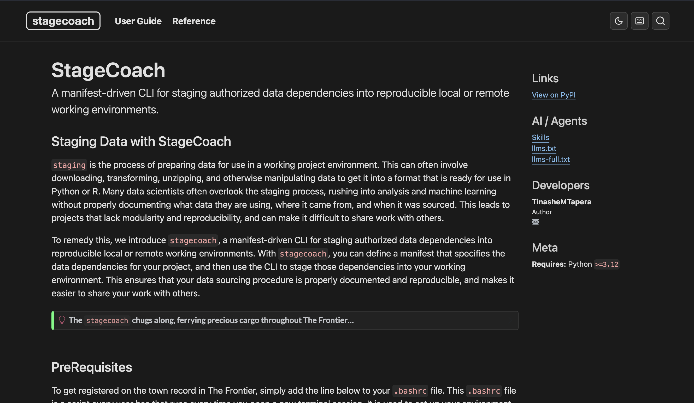
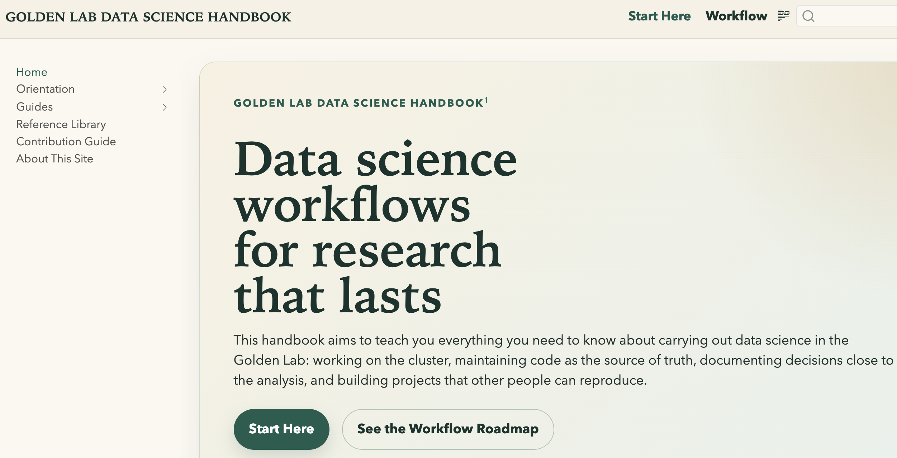
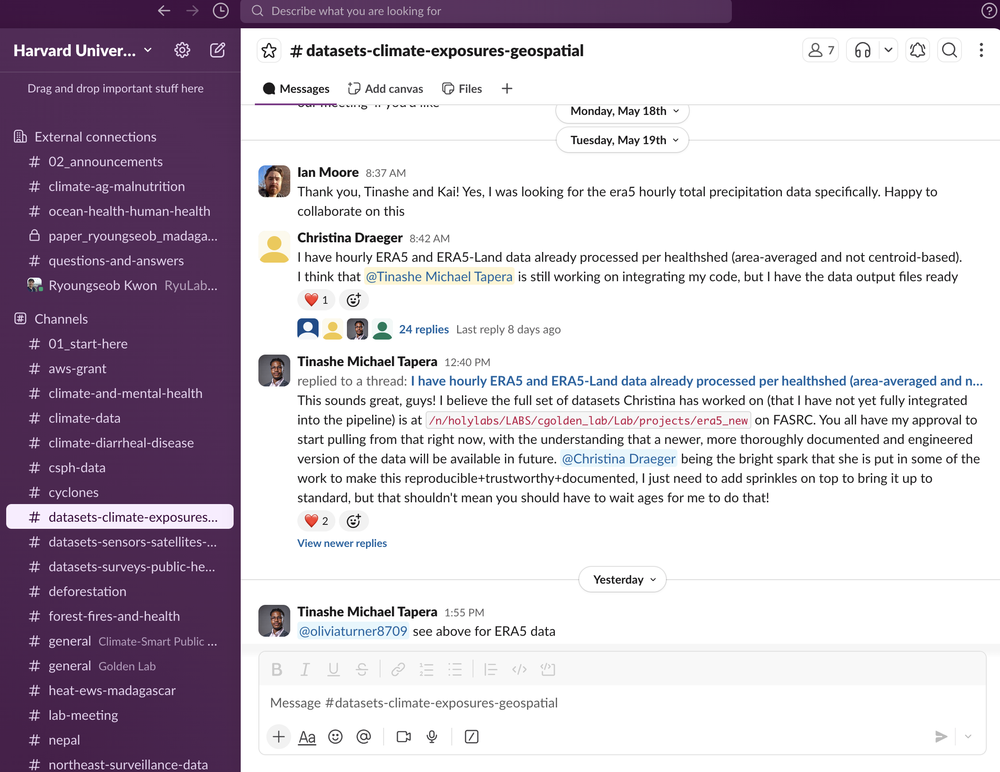

## 1️⃣ 2025-2026: From New Hire to Independent RSE 🤝

::: {.r-fit-text}
**Mission:** Move the lab from ad hoc research computing to more observable, reproducible, and scalable scientific workflows. This required introduction & orientation to...
:::

:::: {.columns}
::: {.column .incremental width="75%"}
- Datasets💽: ERA5, MAHERY Antongil/Darwin/CRS, SouthWest Cohort, MAHERY Clinical-NE, Kiribati Heavy Metals, Aquatic Food Compositions Database, Nepal IMSTAT, DHS, Weather stations, AirQO, and more...
- Infra🏰: Legacy Google Drive, FASRC, GitHub, Globus, Dataverse, Qualtrics
:::

::: {.column width="25%"}
```{mermaid}
flowchart TB
  A[Scientific outputs]
  B[Reproducible workflows]
  C[Data/project infrastructure]
  D[HPC, Git, Globus, docs, automation]
  D --> C --> B --> A
```
:::
::::

## 1️⃣ 2025-2026: From New Hire to Independent RSE 🤝

::: {.r-fit-text}
**Mission:** Move the lab from ad hoc research computing to more observable, reproducible, and scalable scientific workflows. This required introduction & orientation to...
:::

:::: {.columns}
::: {.column .incremental width="75%"}
- Tools 🛠️: R, Python, Quarto, DAG pipelines, Slurm, Git, Markdown, RStudio, VSCode
- Communication 🗣️: Lab meetings, one-on-one support, documentation, workshops, project-specific 
contexts, Emails, Slack, Basecamp
:::

::: {.column width="25%"}
```{mermaid}
flowchart TB
  A[Scientific outputs]
  B[Reproducible workflows]
  C[Data/project infrastructure]
  D[HPC, Git, Globus, docs, automation]
  D --> C --> B --> A
```
:::
::::

## 2️⃣ Let's be honest, this is a lot...😮‍💨

::: {.r-fit-text}
**Breadth:** The scope of RSE/research data management/technological support in academia is broad, spanning technical, educational, and operational domains. It requires learning new tools, deeply understanding disparate research project contexts, and building durable lab capabilities.

**Novelty:** Still a nascent field/territory within academia, with few established best practices & expert communities (USRSE < 8 years old). 
This means each lab is learning by doing, trial and error, and building from scratch ad infinitum.

**Goal MisAlignment:** What pays bills? Papers. Not code. But what pays bills is often not what supports reproducibility, scalability, or even the research itself. This creates tension between short-term outputs and long-term infrastructure.

**Incentive MisAlignment:** Scientists are disincentivized from investing in durable infrastructure that supports reproducibility and scalability because it is not recognized as a research output. This creates tension between individual career incentives and collective lab needs.
:::

# 3️⃣ So what are we _actually_ doing?

::: {.fragment}
"I imagine running a lab is a lot like running a startup, except we have **_no_** Y-combinator money." - Ted Satterthwaite, UPenn, 2018
:::

---


Answer: RSEOps.^[RSEOps = Research Software Engineering Operations. A term I use to describe the operational layer of research computing that supports reproducibility, scalability, and efficiency in scientific endeavours. Also see [Sochat, n.d.](https://rse-ops.github.io/landscape/src/rse-ops.pdf) ]


---

#### 4️⃣ RSEOps is about using research computing & technology to optimize research mission outcomes & materialize the scientific vision — not tools

::: columns
::: {.column width="5%"}
:::

::: {.column width="40%"}
::: bulletbox
::: {.fragment .fade-in-then-semi-out}
{width="300px"}
:::
:::
:::

::: {.column width="5%"}
:::

::: {.column width="40%"}
::: bulletbox
::: {.fragment .fade-in-then-semi-out}
{width="300px"}
:::
:::
:::

::: {.column width="5%"}
:::
:::

::: columns
::: {.column width="5%"}
:::

::: {.column width="40%"}
::: bulletbox
::: {.fragment .fade-in-then-semi-out}
{width="300px"}
:::
:::
:::

::: {.column width="5%"}
:::

::: {.column width="40%"}
::: bulletbox
::: {.fragment .fade-in-then-semi-out}
{width="300px"}
:::
:::
:::

::: {.column width="5%"}
:::
:::
---

## 5️⃣ So What has Changed?

:::{.r-fit-text}
**🌐Remote First:** Lean in to FASRC as our primary (and preferably, _only_) compute environment.
:::

:::: {.columns}
::: {.column .r-fit-text .incremental .fade-in-then-semi-out width="50%"}
- I love working on my laptop! → it only works on my machine → reluctance to distribute work → **replication/reproducibility crisis**^[[This has not gone away!](https://journals.sagepub.com/cms/10.1177/25152459251323480/asset/a6c85b1e-9f07-4908-8e45-84e411b1631c/assets/images/large/10.1177_25152459251323480-fig2.jpg)]
- **Begin with the end in mind:** you won't have to "figure out how to make it run on X" if you started with X in the first place.
- **Vision:** a project can be cloned, installed, and run on any environment/machine, producing replicable results with zero intervention
- **Actions:** Make FASRC the _easy_ choice (🔄 Sync Google Drive & FASRC, ⛔ reject collaboration on local-only workflows, 🔧 develop/maintain convenience tools like `stagecoach`, 🎁 share big data using Globus-FASRC plugin)
:::

::: {.column .r-fit-text .incremental width="50%"}
::: {.fragment}
| Metric | 24-25AY| 25-26AY |
|---|------:|------:|
| Jobs submitted^[One week] | 0 | 168 |
| CPU-hours used^[Full year] | 0 | 4110 |
:::
- `sreport cluster UserUtilizationByAccount -t Hour Accounts=cgolden_lab Start=2026-01-01 End=2026-06-01 Tree`
- `sreport cluster UserUtilizationByAccount -t HourPer Accounts=cgolden_lab Start=2026-01-01 End=2026-06-01 Tree`

:::
::::

## 5️⃣ So What has Changed?

:::{.r-fit-text}
**💎 Code as Source of Truth:** The "methods section" is the currency of science
:::

:::: {.columns}
::: {.column .r-fit-text .incremental .fade-in-then-semi-out width="65%"}
- We were asked to share how we implemented a particular method → we got the original dataset from a collaborator, but we don't talk 
anymore → someone fixed some of the values in Excel → we didn't write down what version of `dplyr` we 
used, so the code crashes → you might have to issue a **retraction** 😰
- **The code _is_ your methods section:** Science happens when someone else can repeat your experiment and get the same 
result based on your instructions.
- **Vision:** All data processing and analysis steps are implemented in code that is well-documented, version-controlled, and shared in a way that 
others can easily access and run it.
- **Actions:** Create central GitHub repository for _all_ lab activities, fork repos, promote machine-readable tools to enable 
code-as-methods (e.g. pipelines as DAGs, notebooks as experiments, `stagecoach` manifest), link tasks to GitHub issues, and provide training and 
support to help students and collaborators adopt these practices.
:::

::: {.column .r-fit-text .incremental width="35%"}

::: {.fragment}

:::

:::
::::

## 5️⃣ So What has Changed?

:::{.r-fit-text}
**📊 Communication over Sophistication:** Reading/writing science is hard; make it easy with notebooks!
:::

:::: {.columns}
::: {.column .r-fit-text .incremental .fade-in-then-semi-out width="60%"}
- Reading code sucks. Writing code sucks. We are not engineers, we are scientists. We want to understand the science, not the code.
- **Literate Programming:** There is no excuse not to use notebooks for _(nearly)_ everything^[Before you come at me with your arguments about how notebooks are a terrible software development medium, I disagree — and I can prove it]. 
- **Vision:** Science is as fun and easy to read as it is to create. Notebooks allow you to interleave plain-text code, results, and narrative in a way that is simultaneously digestible and comprehensive.
- **Actions:** Create a project template that encourages using notebooks for data processing and analysis, provide training and support to help students and collaborators adopt this practice, and promote the use of notebooks as a standard for scientific communication within the lab.
:::

::: {.column .r-fit-text .incremental width="40%"}

::: {.fragment}
{width="300px"}

{width="300px"}
:::

:::
::::

## 5️⃣ So What has Changed?

:::{.r-fit-text}
**🌱 Good Habits Compound:** Save on technical debt by implementing best practices early and often
:::

:::: {.columns}
::: {.column .r-fit-text .incremental .fade-in-then-semi-out width="65%"}
- How do I move my code to GitHub? I'm _scared_ to change this file, _I don't remember_ how it works. This process _took really long_, I don't want to do 
it again. I _don't have time_ to write documentation, I'll just tell people how it works when they ask.
- **Technical debt:** The future cost of doing things the quick and dirty way. It compounds over time.
- **Vision:** We have a culture of best practices that support reproducibility, scalability, and efficiency in our research.
- **Actions:** Provide careful, _empathetic training and support_ to help students and collaborators adopt best practices, and 
encourage a _culture of learning_ that supports the lab's research mission. Further, 
encourage "open learning" by _never_ shying away from sharing WIPs, _always_ praising incremental progress and effort, and _immediately_ democratizing knowledge in public documentation, code repositories, and conversations.
:::


::: {.column .r-fit-text .incremental width="35%"}

::: {.fragment}
{width="300px"} 

{width="300px"}
:::
:::
::::

## 6️⃣ Strategic impact & looking ahead


**RSEOps:** operationalizing the shift toward more reproducible, scalable, and efficient research practices.

:::: {.columns}
::: {.column .r-fit-text width="40%"}
### Impact this year

- Made lab computing activity more visible.
- Strengthened reproducible analysis practices.
- Improved data transfer and documentation workflows.
- Converted project-specific lessons into reusable lab infrastructure.
- Helped students and collaborators work more independently and consistently.
:::

::: {.column .r-fit-text width="60%"}
### Priorities for next year

1. _n-of-1 experiment_: Practice what we preach by doing, documenting, and demoing first. Do-as-I-do.
2. _Principles before tools_: Before introducing a new tool or workflow, clearly articulate how it fits into the RSEOps principles of remote-first, code-as-source-of-truth, communication-over-sophistication, and good-habits-compound. Show that it will bring value by advancing the mission.
3. _Strengthen collaboration_: What can we cherry pick from NSAPH's existing RSEOps ecosystem? What can we contribute back? How can we leverage NSAPH's collective expertise to build durable lab infrastructure?
4. _RSEOps Artifacts_: Promote the creation and maintenance of RSEOps artifacts (datasets, projects, documentation, training materials, convenience tools) that support reproducibility, scalability, and efficiency in our research workflows, and _reward_ their use and maintenance as much as we reward papers.
5. _Ecosystem development_: Continue to build out a cohesive ecosystem of tools that support reproducibility, scalability, and continuous learning in our research workflows.
:::
::::
