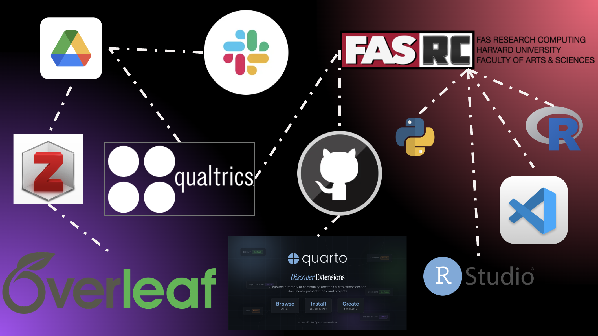

## Strategic impact & looking ahead

**RSEOps:** _operationalizing_ the shift toward more reproducible, scalable, and efficient research practices.

:::: {.columns}

::: {.column .r-fit-text width="60%"}
### Where we've been...

- Increased visibility of Research Computing
- Strengthened reproducible analysis practices.
- Improved data transfer and documentation workflows.
- Converted project-specific lessons into reusable lab infrastructure.
- Helped students and collaborators work more independently and consistently.
- Built a data-driven foundation for continuous improvement, measurable outcomes, and strategic planning
:::

::: {.column .r-fit-text width="40%"}
{width="400px"}
:::

::::

## Strategic Impact & Looking Ahead

**RSEOps:** _operationalizing_ the shift toward more reproducible, scalable, and efficient research practices.

:::: {.columns}
::: {.column .r-fit-text width="75%"}
### Where we're going...

1. _n-of-1 experiment_: Practice what we preach — be the first.
2. _Principles before tools_: Before introducing a new tool or workflow, clearly articulate how it fits into the RSEOps principles.
3. _Strengthen collaboration_: What can we cherry pick from NSAPH's existing RSEOps ecosystem? What can we contribute back? How can we leverage NSAPH's collective expertise to build durable lab infrastructure?
4. _RSEOps Artifacts_: Create & maintain RSEOps artifacts (datasets, projects, documentation, training materials, convenience tools) and _reward_ their use and maintenance as much as we reward papers.
5. _Ecosystem development_: Continue to build out a cohesive ecosystem of tools that support reproducibility, scalability, and continuous learning in our research workflows.
:::

::: {.column .r-fit-text width="25%"}
![Behavior change is hard, but possible when you create a supportive environment^[Fogg Behavior Model: https://www.behaviormodel.org/]](https://happily.ai/blog/content/images/2025/11/CleanShot-2025-11-04-at-22.19.11@2x.png){width="400px"}
:::
::::

## Highlights

:::: {.columns}
::: {.column .r-fit-text .incremental .fade-in-then-semi-out width="45%"}
**1. 🌐Remote First:** Lean in to FASRC as our primary (and preferably, _only_) compute environment.

**2. 💎 Code as Source of Truth:** The "methods section" is the currency of science

**3. 📊 Communication over Sophistication:** Reading/writing science is hard; make it easy with notebooks!

**4. 🌱 Good Habits Compound:** Save on technical debt by implementing best practices early and often
:::

::: {.column .r-fit-text .incremental width="55%"}

::: {.fragment}
 
:::
:::
::::